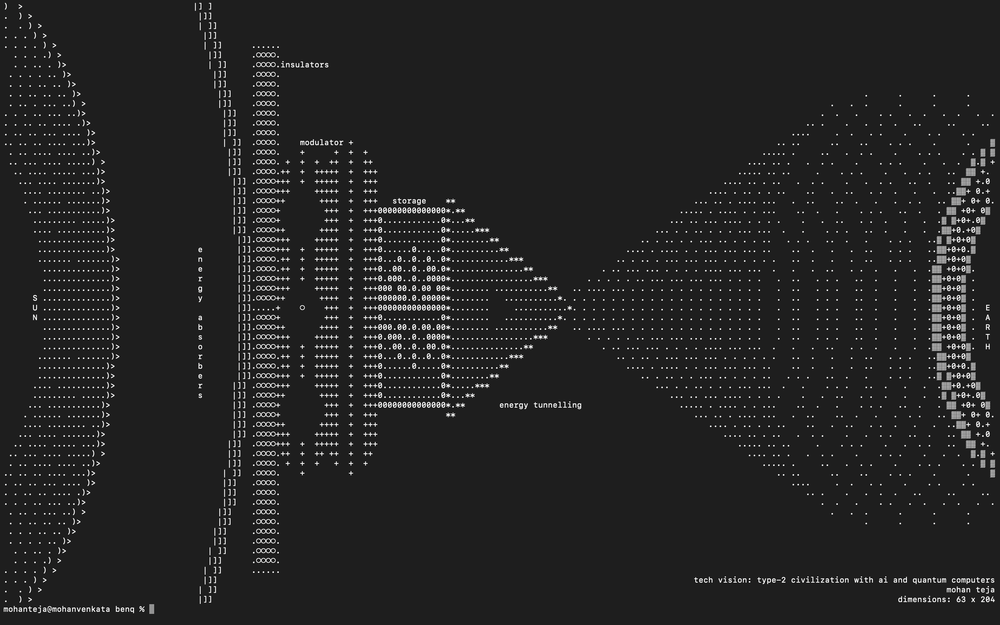

This repo has some self made tools to create ascii art 
used it in [Benq programming contest](https://www.benq.com/en-in/campaign/best-coding-monitor-for-programmers/event.html) to create an art for theme ***code your tech vision***
use `npm run start` to run the code
use `npm run build` to build the project

